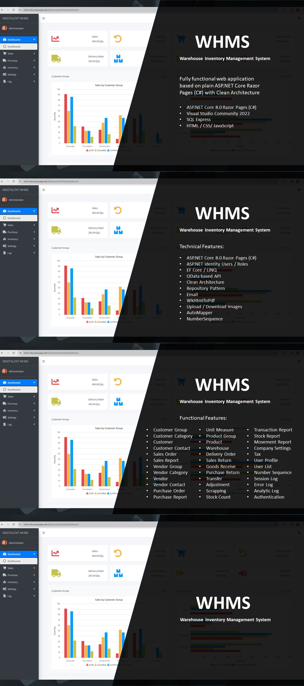
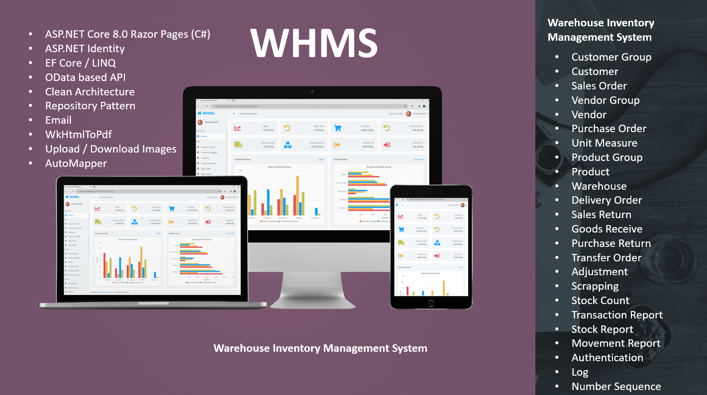

# Introduction
Welcome to our Warehouse Inventory Management System (WHMS), a cutting-edge solution meticulously designed to revolutionize your inventory operations. Powered by ASP.NET Core 8.0 Razor Pages (C#), WHMS offers a comprehensive suite of features including Sales, Purchase, Delivery, Goods Receive, Transfer, Adjustment, Return, Scrapping, Stock Count, Transaction Report, Movement Report, and Stock Report. Seamlessly manage your warehouse inventory with ease and precision, ensuring optimal stock levels, streamlined workflows, and enhanced productivity. Experience the future of inventory management with WHMS – your ultimate tool for operational excellence.

# Technical Features
- ASP.NET Core 8.0 Razor Pages (C#)
- ASP.NET Identity Users / Roles
- EF Core / LINQ
- OData based API (Server side: paging, filter, search, sort)
- Clean Architecture
- Repository Pattern
- Email
- WkHtmlToPdf
- Upload / Download Images
- AutoMapper
- NumberSequence

# Functional Features
- Customer Group
- Customer Category
- Customer
- Customer Contact
- Sales Order
- Sales Report
- Vendor Group
- Vendor Category
- Vendor
- Vendor Contact
- Purchase Order
- Purchase Report
- Unit Measure
- Product Group
- Product
- Warehouse
- Delivery Order
- Sales Return
- Goods Receive
- Purchase Return
- Transfer
- Adjustment
- Scrapping
- Stock Count
- Transaction Report
- Stock Report
- Movement Report
- Company Settings
- Tax
- User Profile
- User List
- Number Sequence
- Error Log
- Analytic Log
- Authentication / Membership

# Run The Project: Visual Studio
This project is just another ASP.NET project so every official docs or tutorial related to ASP.NET will also apply to this project.
Basically there are at least five simple steps:
- Open the project using Visual Studio
- Change the connection string (appsettings.json) to target your MS SQL Server
- Right Click Clean
- Right Click Build
- Run the project by clicking green play button on your Visual Studio toolbar
note: The project will automatically create the Database if the database not already exists.

# Run The Project: IIS Web Server
This project is just another ASP.NET project so every official docs or tutorial related to ASP.NET will also apply to this project.
Follow this link from Microsoft official docs regarding project host and deployment: [https://learn.microsoft.com/en-us/aspnet/core/tutorials/publish-to-iis?view=aspnetcore-8.0&tabs=visual-studio](https://learn.microsoft.com/en-us/aspnet/core/tutorials/publish-to-iis?view=aspnetcore-8.0&tabs=visual-studio)
Basically there are two important steps:
- Convert the source code to distributable by right click > publish. note: put those files to some folder of your choice.
- Put the files from first step to IIS. note: There are a lot of good tutorial about this.
Tips:
- Please make sure there are no problem connecting to database server from your web server

# Live Demo Link
- Url: [https://whms-lte.csharpasp.net/](https://whms-lte.csharpasp.net/)
- Username: admin@gmail.com
- Password: 123456

# Credit
- Syncfusion Community License for UI Control. [https://www.syncfusion.com/products/communitylicense](https://www.syncfusion.com/products/communitylicense) 
- AdminLTE for HTML Admin Template. [https://adminlte.io/](https://adminlte.io/)

# Starred
Help us grow by give a star.

# Supporter
This project supported by: INDOTALENT [https://store.indotalent.com](https://store.indotalent.com). Feel free to visit their site and use 50% discount using discount code: **GITHUB50**

